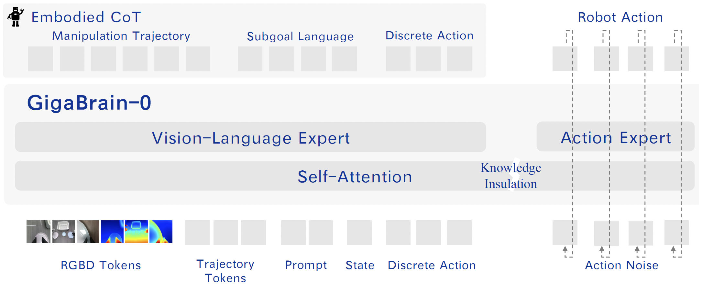
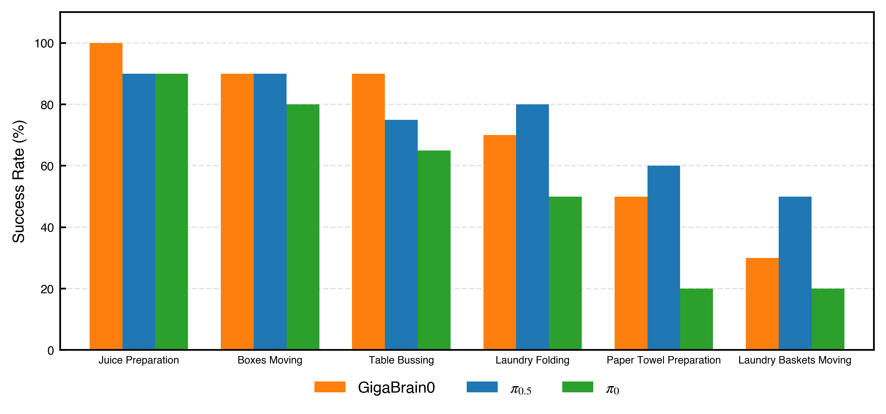

<div align="center" style="font-family: charter;">
    <h1> GigaBrain-0: A World Model-Powered Vision-Language-Action Model </h1>

[](https://opensource.org/licenses/Apache-2.0)
[](https://gigabrain0.github.io/)
[](https://arxiv.org/abs/2510.19430)
[](https://huggingface.co/open-gigaai/models)

</div>

## ✨ Introduction

Training Vision-Language-Action (VLA) models for generalist robots typically requires large-scale real-world robot data, which is expensive and time-consuming to collect. The inefficiency of data collection severely limits the scalability, and generalization capacity of current VLA systems. Therefore, we introduce GigaBrain-0, a novel VLA foundation model empowered by world model-generated data. By leveraging world models to generate diverse data at scale, GigaBrain-0 significantly reduces reliance on real robot data while improving cross-task generalization. Our approach further improves policy robustness through RGBD input modeling and embodied Chain-of-Thought (CoT) supervision, enabling the model to reason about spatial geometry, object states, and long-horizon dependencies during task execution. This leads to substantial gains in real-world performance on dexterous, long-horizon, and mobile manipulation tasks. Extensive experiments demonstrate that GigaBrain-0 achieves superior generalization across variations in appearances (e.g., textures, colors), object placements, and camera viewpoints.



Leveraging the efficient world-model data engine and innovations in model architecture, GigaBrain-0 has demonstrated rapid performance improvements. The currently released version not only significantly surpass $\pi_0$ but also deliver performance comparable to $\pi_{0.5}$.



## 📰 News

- **`[2025/11/27]`** Released GigaBrain-0 model weights. This version of the model excludes depth images and intermediate 2D manipulation trajectories for more user-friendly use. However, the code supports these features — if your dataset contains them and you wish to use them, simply enable the corresponding options in the configuration.
- **`[2025/11/27]`** Released the model architecture, as well as the pre-training and post-training implementations.

## ⚡ Installation

GigaBrain-0 depends on the following three frameworks:

- [GigaTrain](https://github.com/open-gigaai/giga-train): An Efficient and Scalable Training Framework for AI Models.
- [GigaDatasets](https://github.com/open-gigaai/giga-datasets): A Unified and Lightweight Framework for Data Curation, Evaluation and Visualization.
- [GigaModels](https://github.com/open-gigaai/giga-models): A Comprehensive Repository for Multi-modal, Generative, and Perceptual Models.

We recommend a fresh conda environment.

```bash
conda create -n giga_brain_0 python=3.11.10 -y
conda activate giga_brain_0

pip3 install giga-train
pip3 install giga-datasets
pip3 install lerobot==0.3.2
pip3 install matplotlib
pip3 install numpydantic

git clone https://github.com/open-gigaai/giga-models.git
cd giga-models
pip3 install -e .

git clone https://github.com/open-gigaai/giga-brain-0.git
cd giga-brain-0

```

## 🚀 Quick Start

### 1. Data preparation (LeRobot format) and normalization

To begin, convert your data to the LeRobot format. For reference, see `scripts/convert_from_hdf5.py`, which demonstrates how to convert AgileX data (HDF5 files) to LeRobotDataset.

```bash
python scripts/convert_from_hdf5.py \
  --data-path /path/to/raw_hdf5_data_path \
  --out-dir /path/to/lerobot_dataset \
  --task "Task prompt here"
```

If your dataset is already in LeRobot format, compute normalization stats for `observation.state` and `action` using our script:

```bash

python scripts/compute_norm_stats.py \
  --data-paths /path/to/lerobot_dataset1 /path/to/lerobot_dataset2 \
  --output-path /path/to/norm_stats.json \
  --embodiment-id {embodiment-id} \
  --delta-mask {delta-mask} \
  --sample-rate 1.0 \
  --action-chunk 50 \
  --action-dim 32

```

For AgileX Cobot Magic:

- embodiment_id = 0
- delta_mask = \[True, True, True, True, True, True, False, True, True, True, True, True, True, False\]

For Agibot G1:

- embodiment_id = 1
- delta_mask = \[True, True, True, True, True, True, True, False, True, True, True, True, True, True, True, False, True, True, True, True\]

To support custom robot-type data, you can add a newly initialized action-specific linear and train the newly added linear only and freeze other weights.

Then point your training config to the produced `norm_stats.json` (see examples in `configs`).

### 2. Download GigaBrain-0 checkpoints from Hugging Face

|         Model         |                                  HF Link                                   |                                                           Description                                                            |
| :-------------------: | :------------------------------------------------------------------------: | :------------------------------------------------------------------------------------------------------------------------------: |
| GigaBrain-0-3.5B-Base | 🤗 [Huggingface](https://huggingface.co/open-gigaai/GigaBrain-0-3.5B-Base) | The current release of the model excludes depth images and intermediate 2D manipulation trajectories for more user-friendly use. |

### 3. Training

We provide ready-to-use configs for GigaBrain-0. Adjust `gpu_ids`, `batch_size_per_gpu`, `data_paths`, and `norm_stats_path` as needed.

Logs, configs and checkpoints will be stored at the path `project_dir`

Pre-training:

```bash
python scripts/train.py --config configs.giga_brain_0_from_scratch.config
```

Fine-tuning:

```bash
python scripts/train.py --config configs.giga_brain_0_agilex_finetune.config  # or

python scripts/train.py --config configs.giga_brain_0_agibot_finetune.config
```

Configuration details can be checked in [configure_introduction.md](docs/configure_introduction.md)

### 4. Inference

Run inference on a LeRobot dataset and optionally visualize predictions.

For the same model weights, we provide three different scripts to support different output information.

- Inference continuous action:

  ```bash
  python scripts/inference.py \
    --model-path /path/to/giga_brain_0_checkpoints \
    --data-path /path/to/lerobot_dataset \
    --norm-stats-path /path/to/norm_stats.json \
    --output-path /tmp/vis_path \
    --delta-mask <DELTA_MASK> \
    --embodiment-id <EMBODIMENT_ID> \
    --action-chunk 50 \
    --original-action-dim <ACTION_DIM> \
    --tokenizer-model-path google/paligemma2-3b-pt-224 \
    --fast-tokenizer-path physical-intelligence/fast \
    --device cuda
  ```

- Inference subgoal prediction:

  ```bash
  python scripts/inference_task_planning.py \
    --model-path /path/to/giga_brain_0_checkpoints \
    --data-path /path/to/lerobot_dataset \
    --norm-stats-path /path/to/norm_stats.json \
    --delta-mask <DELTA_MASK> \
    --embodiment-id <EMBODIMENT_ID> \
    --original-action-dim <ACTION_DIM> \
    --tokenizer-model-path google/paligemma2-3b-pt-224 \
    --fast-tokenizer-path physical-intelligence/fast \
    --device cuda
  ```

- Inference discrete action in autoregressive mode (usually for debugging):

  ```bash
  python scripts/inference_discrete_action.py \
    --model-path /path/to/giga_brain_0_checkpoints \
    --data-path /path/to/lerobot_dataset \
    --norm-stats-path /path/to/norm_stats.json \
    --output-path /tmp/vis_path \
    --delta-mask <DELTA_MASK> \
    --embodiment-id <EMBODIMENT_ID> \
    --original-action-dim <ACTION_DIM> \
    --tokenizer-model-path google/paligemma2-3b-pt-224 \
    --fast-tokenizer-path physical-intelligence/fast \
    --device cuda
  ```

### 5. Robot deployment

- Run the server:

  ```bash
  python scripts/inference_server.py \
    --model-path /path/to/giga_brain_0_checkpoints \
    --tokenizer-model-path google/paligemma2-3b-pt-224 \
    --fast-tokenizer-path physical-intelligence/fast \
    --delta-mask <DELTA_MASK> \
    --embodiment-id <EMBODIMENT_ID> \
    --norm-stats-path /path/to/norm_stats.json \
    --original-action-dim <ACTION_DIM> \
    --autoregressive-mode-only False
  ```

- Run the client:

  ```bash
  python scripts/inference_client.py
  ```

This is a minimal client example. It generates random observations to demonstrate the end-to-end request/response flow with the server. You can copy the relevant client code onto your robot and replace the random inputs with real onboard sensor data (e.g., cameras, proprioception) and your robot's control interface. Ensure input shapes and field names remain consistent with the server's expectations.

We also provide an inference client script for AgileX robots: `scripts/inference_agilex_client.py`.

Make sure the host and port are the same in both server and client.

## 📄 License

This project is licensed under the Apache License 2.0 - see the [LICENSE](LICENSE) file for details.

## Citation

```bibtex
@article{gigaai2025gigabrain0,
  title={GigaBrain-0: A World Model-Powered Vision-Language-Action Model},
  author={GigaAI},
  year={2025},
  eprint={2510.19430},
  archivePrefix={arXiv},
  primaryClass={cs.CV},
  url={https://arxiv.org/abs/2510.19430},
}
```
