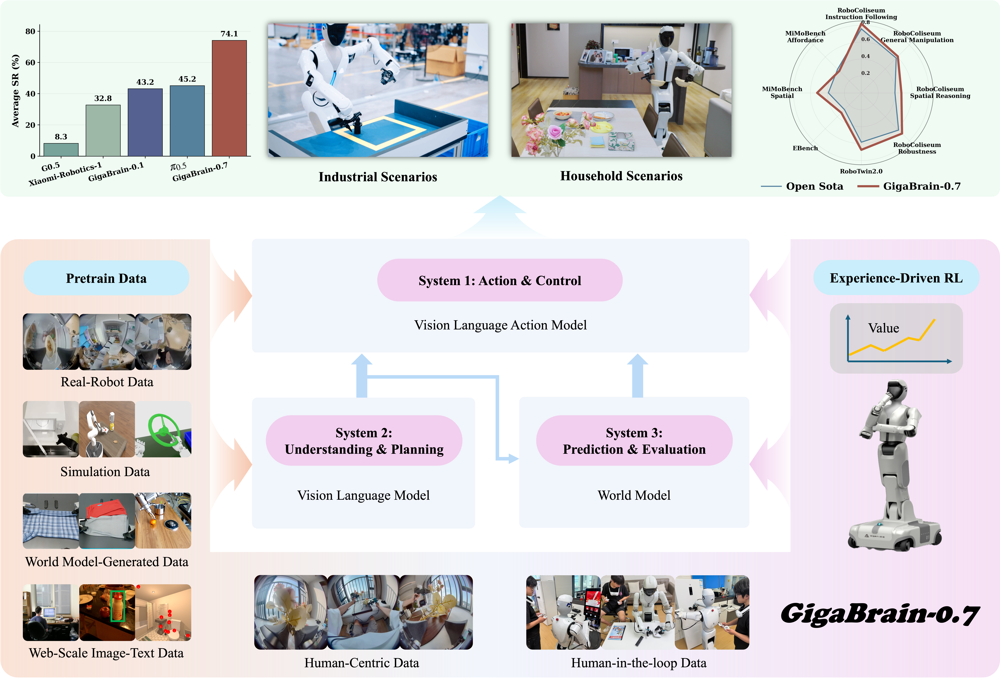
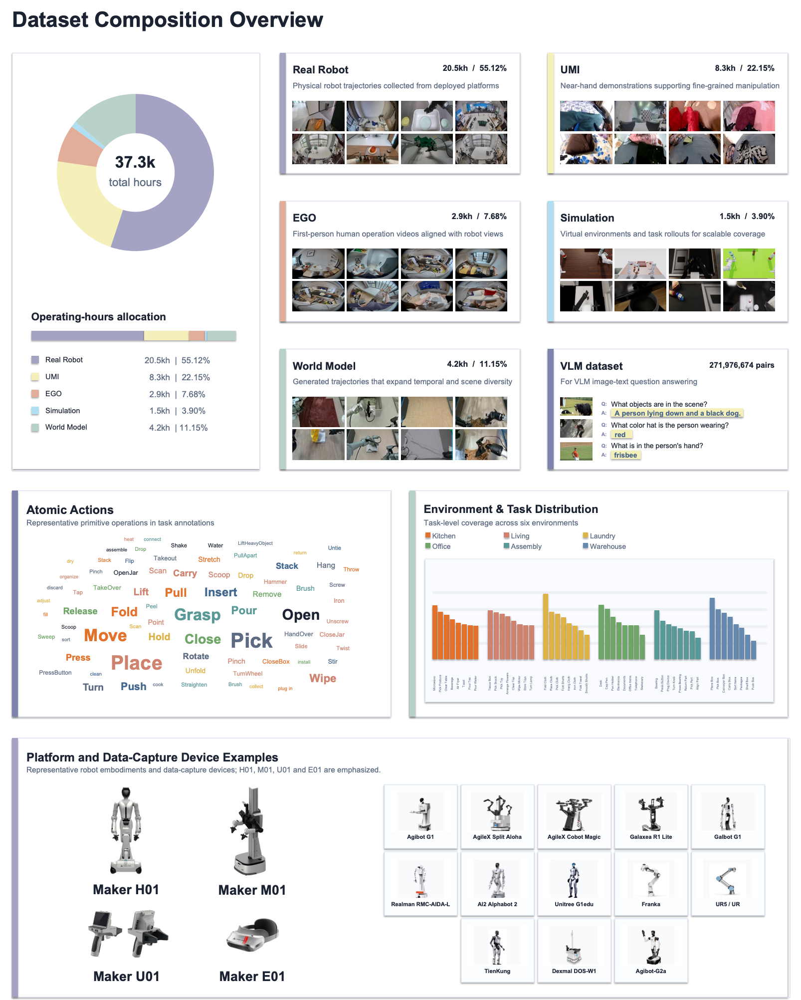

<div align="center" style="font-family: charter;">
    <h1> GigaBrain-0.7: Scaling Embodied Foundation Models to Emergent Capabilities with a Three-System Architecture </h1>

[](https://opensource.org/licenses/Apache-2.0)
[](https://gigaai.cc/blog/gigabrain07)
[](https://arxiv.org/abs/2608.15875)
[](tech_report/GigaBrain-0.7.pdf)
[](https://huggingface.co/open-gigaai/models)
[](https://huggingface.co/open-gigaai/datasets)

</div>

## 📰 News
- **`[2026/09/02]`** Released VLM evaluation code and RoboColiseum, RoboTwin 2.0, and EBench training and evaluation workflows.
- **`[2026/08/25]`** Released the GigaBrain-0.7 Code, Model and Sample Data.
- **`[2026/08/17]`** Released the GigaBrain-0.7 technical report.
- **`[2026/03/10]`** We will host the [GigaBrain Challenge 2026 @ CVPR 2026](https://gigaai-research.github.io/GigaBrain-Challenge-2026/) with three competition tracks: RoboTwin (simulation), GigaWorld (World Model), and RoboChallenge (real robot). We also have a call for papers on [OpenReview](https://openreview.net/group?id=thecvf.com/CVPR/2026/Workshop/GigaBrain_Challenge) and will select a Best Paper Award.
- **`[2026/02/13]`** Released [GigaBrain-0.5M* technical report](https://gigabrain05m.github.io/). GigaBrain-0.5M* is a VLA that learns from world model-based reinforcement learning.
- **`[2026/02/09]`** GigaBrain-0.1 achieved 1st place on the RoboChallenge leaderboard. 🎉
- **`[2026/02/02]`** Released GigaBrain-0.1 model weights, which follow the same usage as GigaBrain-0 but achieve better performance.
- **`[2025/11/27]`** Released GigaBrain-0 model weights. This version of the model excludes depth images and intermediate 2D manipulation trajectories for more user-friendly use. However, the code supports these features — if your dataset contains them and you wish to use them, simply enable the corresponding options in the configuration.
- **`[2025/11/27]`** Released the model architecture, as well as the pre-training and post-training implementations.

## TODO
- [x] Release the GigaBrain-0.7 technical report.
- [x] Release the GigaBrain-0.7 Code, Model and Sample Data.
- [x] Release VLM evaluation code.
- [x] Release RoboColiseum benchmark code.
- [x] Release RoboTwin2.0 benchmark code.
- [x] Release EBench benchmark code.


## ✨ Introduction

Vision-language-action (VLA) models have become a dominant paradigm for
generalist embodied agents, demonstrating strong complex and long-horizon task
completion in structured settings. Yet it remains an open question whether
current VLA systems can benefit from more effective architectural design, scale
to substantially larger and more heterogeneous data regimes, and achieve
broader generalization across tasks and embodiments. To this end, we present
GigaBrain-0.7, an embodied foundation model with substantially improved
generalization across diverse robot embodiments. Specifically, GigaBrain-0.7
unifies understanding, prediction, and action through a three-system
architecture, scales pretraining to over 37,000 hours of heterogeneous embodied
data, and introduces one-stage alignment training that jointly optimizes
vision-language understanding and multi-embodiment action generation. Compared
with the preceding GigaBrain-0 series and prior state-of-the-art models including
&pi;<sub>0.5</sub>, GigaBrain-0.7 achieves substantial improvements in foundation
zero-shot capabilities, language-conditioned instruction following, and
post-training task success rates. In particular, on our in-house Maker H01
platform and mainstream robot embodiments, GigaBrain-0.7 demonstrates strong
task adaptability and completion ability across both home and industrial
scenarios.


## 💾 Data

The GigaBrain-0.7 summarizes 37.3k hours of heterogeneous
embodied pre-training data, including real-robot, UMI, egocentric, simulation,
and world-model-generated data.



## ⚡ Installation

This installation supports the two top-level mainline training configs:
[`gb07_pg2_pick_and_place_piper_30k.py`](configs/gb07_pg2_pick_and_place_piper_30k.py)
and
[`gb07_pg2_push_buttons_h01_30k.py`](configs/gb07_pg2_push_buttons_h01_30k.py).
Benchmark workflows use their own installation instructions and external
dependencies; see the guides in [Benchmark releases](#-benchmark-releases).

The mainline workflow uses the following dependencies:

1. [`giga-datasets==1.1.0`](https://pypi.org/project/giga-datasets/1.1.0/)
2. [`giga-train==1.1.0`](https://pypi.org/project/giga-train/1.1.0/)
3. [`giga-models@1.1.0`](https://github.com/open-gigaai/giga-models/tree/1.1.0)

Use a fresh environment for the pinned PaliGemma2 stack:

```bash
conda create -n gigabrain07 python=3.11.10 -y
conda activate gigabrain07

# Run from the GigaBrain-0.7 repository root.
export GIGA_BRAIN_ROOT="$PWD"

python -m pip install -r requirements-paligemma2.txt
python -m pip install "giga-datasets==1.1.0"
python -m pip install "giga-train==1.1.0"
python -m pip install "git+https://github.com/open-gigaai/giga-models.git@1.1.0" --no-deps

export PYTHONPATH="$GIGA_BRAIN_ROOT${PYTHONPATH:+:$PYTHONPATH}"
```

**LeRobot v2.1 compatibility for the two mainline configs:** If their input
data uses the LeRobot v2.1 format, replace the `giga-datasets==1.1.0`
installation above with:

```bash
python -m pip install "giga-datasets==1.0.0"
```

This substitution is not a repository-wide benchmark requirement. Benchmark
workflows may use different dataset readers and dependency versions; follow
the corresponding benchmark guide instead.

## 🚀 Quick start

This section covers the mainline PiPER and H01 configs linked in
[Installation](#-installation). Run all commands from the repository root after
completing the installation and environment exports above. For benchmark
training or evaluation, start from the corresponding guide in
[Benchmark releases](#-benchmark-releases).

### 1. Download
Download GigaBrain-0.7 models and sample data from Hugging Face.
| Resource | HF Link | Description |
| :---: | :---: | :--- |
| GigaBrain-0.7-3.5B-Base | 🤗 [Hugging Face](https://huggingface.co/open-gigaai/GigaBrain-0.7-3.5B-Base) | The pretrained 3.5B base model for GigaBrain-0.7. |
| GigaBrain-0.7-3.5B-RoboTwin2.0-Clean | 🤗 [Hugging Face](https://huggingface.co/open-gigaai/GigaBrain-0.7-3.5B-RoboTwin2.0-Clean) | The GigaBrain-0.7 3.5B model fine-tuned on clean RoboTwin2.0 data. |
| GigaBrain-0.7-3.5B-EBench | 🤗 [Hugging Face](https://huggingface.co/open-gigaai/GigaBrain-0.7-3.5B-EBench) | The GigaBrain-0.7 3.5B model fine-tuned for EBench. |
| GigaBrain-0.7-SampleData | 🤗 [Hugging Face](https://huggingface.co/datasets/open-gigaai/GigaBrain-0.7-SampleData) | Sample data for running the GigaBrain-0.7 training workflow. |

### 2. Norm

Training data is expected in LeRobot format. Use
[compute_norm_stats_fast.py](scripts/compute_norm_stats_fast.py)
to read the LeRobot frame Parquet files directly and compute normalization
statistics for `observation.state` and `action`:

```bash
python scripts/compute_norm_stats_fast.py \
  --data-paths /path/to/lerobot_dataset1 /path/to/lerobot_dataset2 \
  --output-path /path/to/norm_stats.json \
  --embodiment-id 6 \
  --delta-mask \
    True True True True True True False True \
    True True True True True False False False \
  --sample-rate 1.0 \
  --action-chunk 50 \
  --action-dim 32 \
  --num-workers 64
```

The mask above is the AgileX Cobot Magic example. Replace `--embodiment-id`
and the complete, space-separated Boolean mask for other robot types. Keep
`--sample-rate 1.0` when generating final training statistics; lower values
are useful only for an I/O smoke test. Point `norm_stats_path` (or the
corresponding `norm_cfg`) in the training config to the generated file. The
task-specific configs in
`configs` show robot-type masks and dataset layouts
for the current GigaBrain-0.7 training stack.

### 3. Train

Training configs live under `configs`. Adjust
`gpu_ids`, `batch_size_per_gpu`, dataset paths, and normalization paths for
your environment. The example configs contain internal paths and must be
edited before use outside that environment. Logs and checkpoints are written
below `project_dir`. For a new run, choose a new `project_dir` and set
`train.resume=False`; keep `train.resume=True` only when deliberately resuming
an existing run.

GigaBrain-0.7 uses the following embodiment IDs. These IDs select the
embodiment-specific state and action projections, so keep the pretrained IDs
unchanged when post-training from an existing checkpoint.

| Embodiment ID | Model category | Typical `robot_type` values |
| ---: | --- | --- |
| 0 | `AGILEX` | `aloha`, `mobile_aloha`, `arx5`, `ur5`, and other 6-DoF-per-arm joint-control layouts |
| 1 | `AGIBOT_G1` | `agibot_g1`, `agibot_world`, `franka`, and other 7-DoF-per-arm joint-control layouts |
| 2 | `AGIBOT_DEX` | `agibot_g1_dexhand` and other dexterous-hand robot layouts |
| 3 | `UMI_OMIN` | `UMI_omin`, `umi-giga` |
| 4 | `EGO_DEX` | EgoDex dexterous-hand data |
| 5 | `EGODEX_EEF_HANDBASE` | `egodex_eef_handbase`, `egoverse_eef_handbase`, `wiyh_eef_handbase`, `marker_u01_eef_handbase` |
| 6 | `ROBOCOIN_AGILEX_COBOT_MAGIC` | `agilex_cobot_magic` (the 16D release configuration) |
| 7 | `H01_ROBOT` | `h01_robot` |

The complete default mapping is defined by `EmbodimentId`, `RobotType`, and
`robot_type_mapping` in
[`giga_brain_0_transforms.py`](giga_brain_0/giga_brain_0_transforms.py).
IDs 6 and 7 are built into this mapping and do not require a config override.

To select an embodiment in a training config, make sure the LeRobot dataset's
`robot_type` metadata matches the config key. The training transform resolves
the embodiment ID automatically. For example:

```python
ROBOT_TYPE = "agilex_cobot_magic"

# Inside config["dataloaders"]["train"]["transform"]:
transform=dict(
    type="GigaBrain07Transform",
    delta_action_cfg=dict(
        selector="robot_type",
        mask={ROBOT_TYPE: AGILEX_COBOT_MAGIC_DELTA_MASK},
        # ...
    ),
    norm_cfg=dict(
        selector="data_path",
        norm_stats_path=[
            dict(data_paths=DATA_PATHS, path=NORM_STATS_PATH),
        ],
        # ...
    ),
    # ...
),

# Inside config["models"]:
models=dict(
    num_embodiments=8,
    # ...
),
```

Do not set `robot_type_embodiment_id_overrides` for the built-in IDs above. A
custom override is needed only for a genuinely new robot type or model slot.
In that case, set `models.num_embodiments` to at least the largest ID plus one;
for example, a new ID of 8 requires `num_embodiments=9`. Use the resolved
embodiment ID and the same delta mask when generating normalization statistics,
and point `norm_cfg` to those statistics. Also update the dataset paths, camera
keys/repacking, action mask, and action dimensions to match the new robot's
actual data layout. The two provided configs use the built-in mappings for
AgileX Cobot Magic (ID 6) and H01 (ID 7), respectively.

```bash
# Train GigaBrain-0.7 for AgileX PiPER.
python scripts/train.py \
  --config configs/gb07_pg2_pick_and_place_piper_30k.py

# Train GigaBrain-0.7 for Maker H01.
python scripts/train.py \
  --config configs/gb07_pg2_push_buttons_h01_30k.py
```

Both configs have been validated through real data loading, forward, backward,
AdamW, and scheduler updates. In a controlled ten-step smoke test using the
same batch and flow noise, the pick-and-place loss decreased by 51.27% and the
push-buttons loss decreased by 31.97%. Normal training changes both the batch
and flow noise each step, so inspect a moving average or validation loss rather
than expecting every raw training loss to decrease monotonically.

See [configure_introduction.md](docs/configure_introduction.md)
for the configuration schema.

### 4. Offline LeRobot rollout evaluation

For the two mainline configs, the maintained offline LeRobot rollout entry point is
`inference_gigabrain07_flow_rollout.py`. It rebuilds the training transform,
loads the EMA checkpoint by default, and writes per-episode MSE/MAE metrics
(and optional plots/replays).

This evaluates saved LeRobot episodes; it is separate from the VLM-Benchmark,
RoboColiseum, RoboTwin 2.0, and EBench evaluation workflows linked under
[Benchmark releases](#-benchmark-releases).

```bash
python scripts/inference/inference_gigabrain07_flow_rollout.py \
  --checkpoint-path /path/to/checkpoint_epoch_step \
  --config-path configs/gb07_pg2_pick_and_place_piper_30k.py \
  --data-path /path/to/lerobot_dataset \
  --output-path /tmp/gigabrain07_eval \
  --device cuda:0 \
  --dtype bfloat16 \
  --seed 1 \
  --num-episodes 3 \
  --num-rollouts -1 \
  --no-plot
```

Use `--no-plot` for a metrics-only run, `--checkpoint-subdir model` to use
non-EMA weights, or `--use-predicted-action` for a closed-loop state update.
Run the script with `--help` for the complete set of options.

See the [30k checkpoint evaluation](docs/eval_30k_20260818.md)
for the validated three-episode open-loop results.

### 5. Deployment

The unified server loads train-time preprocessing and delta-mask settings from
`inference_config.json` next to `config.json` in the selected Diffusers
checkpoint directory. New checkpoints write this sidecar automatically. For an
older checkpoint, create it by copying `image_cfg`, `prompt_cfg`, `norm_cfg`,
and `delta_action_cfg` from the matching training config. Always deploy with
the normalization statistics generated for the same dataset and robot schema.

| Deployment profile | `robot_type` | Embodiment ID | State width | Action width | Port |
| --- | --- | ---: | ---: | ---: | ---: |
| AgileX Cobot Magic, fixed base | `agilex_cobot_magic` | 6 | 14 | 14 | 8081 |
| AgileX Cobot Magic, mobile base | `agilex_cobot_magic` | 6 | 14 | 16 | 8081 |
| Maker H01 | `h01_robot` | 7 | 22 | 16 | 8011 |

#### AgileX PiPER

Start the GPU inference **server** from the repository root. Use
`--host 0.0.0.0` when the robot client runs on another machine; use
`127.0.0.1` only when both processes run on the same machine.

```bash
CUDA_VISIBLE_DEVICES=0 python \
  scripts/inference/inference_agilex_server_unified.py \
  --model-path /path/to/checkpoint/model_ema \
  --pretrained-path /path/to/paligemma2-3b-pt-224 \
  --fast-tokenizer-path /path/to/physical-intelligence-fast \
  --norm-stats-path /path/to/norm_stats.json \
  --embodiment-id 6 \
  --robot-type agilex_cobot_magic \
  --original-action-dim 14 \
  --expected-state-dim 14 \
  --host 0.0.0.0 \
  --port 8081
```

On the AgileX ROS host, connect the recommended smooth **client** to the server's
reachable IP address. The server and client ports must match.

```bash
# Replace this example address with the inference server address.
SERVER_IP=192.0.2.10

python \
  scripts/inference/inference_agilex_client_unified_smooth.py \
  --host "${SERVER_IP}" \
  --port 8081 \
  --task-name "Put the cucumber into the woven basket." \
  --image-mode float_native \
  --force-rgb \
  --apply-gripper-rescale \
  --publish-rate 30 \
  --chunk-size 50 \
  --inference-trigger-remaining 30 \
  --max-action-execute-horizon 50 \
  --distance-thresh 0.5 \
  --align-search-window 8
```

The smooth scheduling values must satisfy
`inference_trigger_remaining < max_action_execute_horizon <= chunk_size`.
For mobile-base deployment, change the server to
`--original-action-dim 16 --expected-state-dim 14 --is-robot-moving` and add
`--use-robot-base` to the client. Leave the client's `--action-dim` unset so
it reads the output width from the server handshake.

The equivalent editable templates are
[scripts/inference/agilex/server.bash](scripts/inference/agilex/server.bash)
and
[scripts/inference/agilex/client.bash](scripts/inference/agilex/client.bash).
The client publishes ROS arm and optional base commands, so verify the camera, joint-state, command, and base topics against the target robot before enabling hardware motion.

#### Maker H01

The H01 release profile uses a 22D observation state and a 16D action. Start
the shared **server** launcher with the complete variant configuration:

```bash
MODEL_PATH=/path/to/checkpoint/model_ema \
PRETRAINED_PATH=/path/to/paligemma2-3b-pt-224 \
FAST_TOKENIZER_PATH=/path/to/physical-intelligence-fast \
NORM_STATS_PATH=/path/to/norm_stats.json \
ROBOT_TYPE=h01_robot \
EMBODIMENT_ID=7 \
ORIGINAL_ACTION_DIM=16 \
EXPECTED_STATE_DIM=22 \
IS_ROBOT_MOVING=0 \
IS_BODY_MOVING=0 \
HOST=0.0.0.0 \
PORT=8011 \
CUDA_VISIBLE_DEVICES=0 \
DTYPE=bf16 \
bash scripts/inference/h01/run_h01_server_common.sh
```

The preset
[run_h01_server_s22_a16.sh](scripts/inference/h01/run_h01_server_s22_a16.sh)
uses the same schema, but its model, tokenizer, and normalization paths must be updated for the deployment machine.

On the H01 Jetson, configure the server address and run the smooth **client** in its default dry-run mode:

```bash
# Replace this example address with the inference server address.
SERVER_HOST=192.0.2.10 \
SERVER_PORT=8011 \
SERVER_STATE_DIM=22 \
ACTION_DIM=16 \
CHUNK_SIZE=50 \
INFERENCE_TRIGGER_REMAINING=30 \
MAX_ACTION_EXECUTE_HORIZON=35 \
PROMPT="Push the yellow button next to the plate" \
bash scripts/inference/h01/run_h01_client_smooth.sh
```

If the Jetson paths differ from the launcher defaults, set
`ROS_INTERFACES_SETUP`, `IMAGE_BRIDGE_SETUP`, `OPENPI_CLIENT_SRC`,
`PYTHON_BIN`, and optionally `FAST_DDS_PROFILE`. The launcher defaults to
`--no_init_pose` and does not execute actions. Only after validating the 22D
state, 16D action, three camera streams, ROS topics, and predicted values should
live control be enabled with `EXECUTE_ACTION=--execute_action`. Enable startup
motion separately with `INIT_POSE=--init_pose` and a validated
`READY_POSE_NPY=/path/to/ready_pose.npy`.

## 🧪 Benchmark

Each benchmark has its own environment, external resources, and execution
workflow. Follow the linked guide instead of treating the mainline installation
below as a repository-wide benchmark environment.

| Benchmark | Released workflow | Guide |
| --- | --- | --- |
| VLM-Benchmark | MiMo-Embodied evaluation for GigaBrain-0.7 and embodied VLM baselines | [VLM-Benchmark README](scripts/eval/VLM-Benchmark/README.md) |
| RoboColiseum | Post-training for instruction, spatial, and manipulation suites, plus the platform connector | [RoboColiseum README](configs/robocoliseum_posttrain_release/README.md) |
| RoboTwin 2.0 | Post-training and simulation evaluation across 50 bimanual tasks | [RoboTwin 2.0 README](configs/robotwin_posttrain_release/eval_robotwin/README.md) |
| EBench | Local and online GenManip evaluation | [EBench README](configs/ebench_posttrain_release/eval_ebench/README.md) |

## 📄 License

This project is licensed under the Apache License 2.0. See [LICENSE](LICENSE)
for details.

## 📖 Citation

```bibtex
@article{gigabrainteam2026gigabrain07,
  title={GigaBrain-0.7: Scaling Embodied Foundation Models to Emergent
         Capabilities with a Three-System Architecture},
  author={GigaBrain Team and others},
  journal={arXiv preprint arXiv:2608.15875},
  year={2026},
  eprint={2608.15875},
  archivePrefix={arXiv},
  primaryClass={cs.RO},
  url={https://arxiv.org/abs/2608.15875},
}
```
