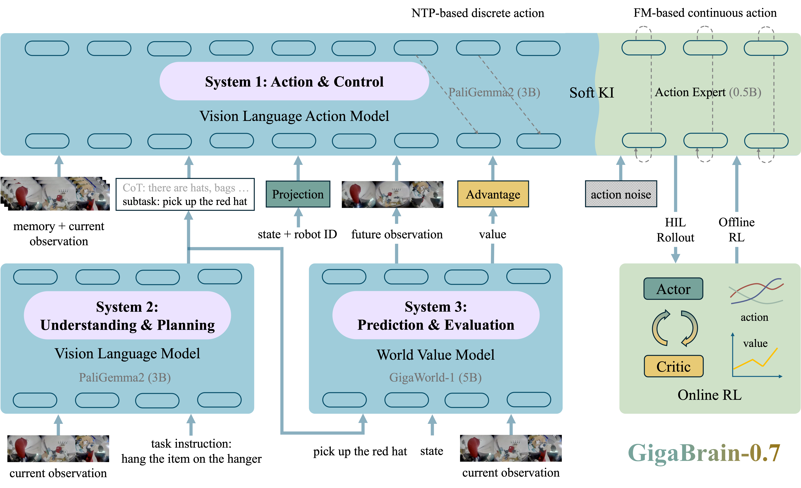

# GigaBrain-0.7

This directory contains the GigaBrain-0.7 project implementation. See the
[repository README](../../../README.md) for the model overview, installation,
data preparation, and citation.

[Project page](https://gigaai.cc/blog/gigabrain07) |
[Technical report](../../../tech_report/GigaBrain-0.7.pdf)



## Training

The maintained entry point is `scripts/train.py`. The two validated PaliGemma2
post-training configs are:

- `configs/gb07_pg2_pick_and_place_piper_30k.py`
- `configs/gb07_pg2_push_buttons_h01_30k.py`

Run a config from this directory:

```bash
python scripts/train.py \
  --config configs/gb07_pg2_pick_and_place_piper_30k.py
```

The example configs contain environment-specific dataset, normalization,
checkpoint, and output paths. Update those values before running them in a
different environment.

## Rollout evaluation

Use the maintained PaliGemma2 flow-rollout evaluator with a checkpoint whose
model options match the selected config:

```bash
python scripts/inference/inference_paligemma2_flow_rollout.py \
  --checkpoint-path /path/to/checkpoint_epoch_step \
  --config-path configs/gb07_pg2_pick_and_place_piper_30k.py \
  --data-path /path/to/lerobot_dataset \
  --output-path /tmp/gigabrain07_eval \
  --device cuda:0 \
  --num-episodes 3 \
  --num-rollouts -1
```

Use `--no-plot` for metrics-only evaluation. The evaluator loads the EMA model
by default; pass `--checkpoint-subdir model` to evaluate the non-EMA weights.
The latest local validation is recorded in
[`docs/eval_30k_20260818.md`](docs/eval_30k_20260818.md).

## Assets

- `docs/source/imgs/gigabrain07_arch.png`
- `docs/source/imgs/gigabrain07_architecture.pdf`
- `docs/source/imgs/data_overview_0816.png`
- `docs/source/imgs/gigabrain07_data_overview.pdf`
